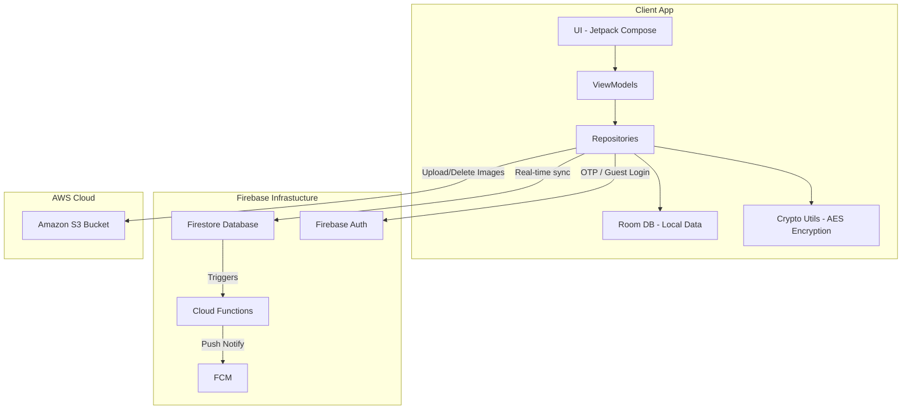
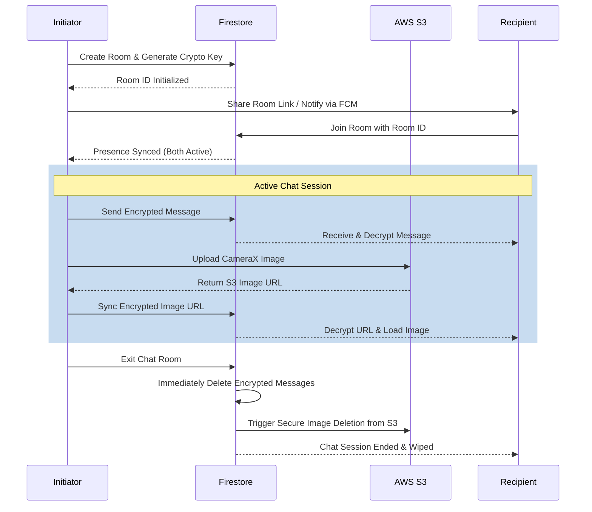

<h1 align="center">
  <br>
  BlinkChat
  <br>
</h1>

<h4 align="center">A highly secure, privacy-first, one-on-one ephemeral messaging Android application.</h4>

<p align="center">
  
  
  
  
</p>

## Overview

**BlinkChat** is designed for private, real-time conversations where messages are **automatically deleted** after exiting the chat screen. The chat only starts when both people are present, making it feel like talking face-to-face, but online. 

Whether you join through a secure guest mode via a shared link or authenticate to chat with your contacts, there is no message history, no data storage, and zero digital footprint left behind. It's ideal for confidential discussions, quick one-time chats, or anything where privacy really matters.

---

## Key Features

- **End-to-End Encryption (E2EE)**: Messages and image URLs are encrypted using symmetric cryptographic keys before being synced to the cloud.
- **Ephemeral Messaging**: Messages and images are automatically wiped from Firebase and AWS S3 the exact moment the chat session is terminated.
- **Presence-based Match**: A conversation only begins when both participants are actively present in the chat room.
- **Guest Mode & Mobile Verification**: Start chatting anonymously via a magic link or securely verify your mobile number to connect with your address book contacts.
- **Secure Image Sharing**: Share photos instantly using modern CameraX integration. Images are uploaded to temporary AWS S3 buckets and deleted completely after the session.
- **Push Notifications**: Stay connected gracefully with Firebase Cloud Messaging (FCM) alerts when someone initiates a secure room.

---

## Tech Stack & Architecture

### **Core Technologies**
- **Language**: Kotlin
- **UI Toolkit**: Jetpack Compose & Material 3
- **Architecture**: MVVM (Model-View-ViewModel) + Clean Architecture principles
- **Dependency Injection**: Dagger-Hilt
- **Local Storage**: Room Database for offline contact resolution
- **Networking**: Retrofit & OkHttp
- **Hardware Integration**: CameraX API for photo capture

### **Backend & Cloud Services**
- **Firebase Authentication**: For robust Telephone Number Verification & Anonymous Guest Login.
- **Firebase Firestore**: Provides real-time synchronization of encrypted messages, typing indicators, and presence states.
- **Firebase Cloud Messaging (FCM)**: For low-latency push notifications.
- **Amazon Web Services (AWS) S3**: Used as a secure, temporary bucket for sharing images without permanent app-server footprint.

---

## System Architecture

Below is a high-level representation of how the application securely mediates between the user and cloud layers.



---

## User Flow Diagram

Our data flow ensures complete ephemerality and zero-knowledge synchronization across participants.



---

## Screenshots


---

## Getting Started

To explore the codebase or run the application locally, follow these setup instructions.

### Prerequisites
- Android Studio Ladybug (or newer recommended)
- A Firebase Project with **Authentication**, **Firestore**, and **Cloud Messaging** enabled.
- An AWS Account with an **S3 Bucket** created and a **Cognito Identity Pool** configured for unauthenticated access.

### Installation & Setup

1. **Clone the repository:**
   ```bash
   git clone https://github.com/amEya911/BlinkChat.git
   ```

2. **Open the project:**
   Launch Android Studio and open the cloned repository.

3. **Firebase Configuration:**
   - Register the application in your Firebase console.
   - Download the `google-services.json` file and place it inside the `app/` directory of the project.

4. **AWS & Auth Variables Configuration:**
   - Navigate to the `app/src/main/java/eu/tutorials/blinkchat/util` package.
   - Create a Kotlin object file named `Ids.kt`.
   - Add your specific credentials from AWS and Firebase:
     ```kotlin
     package eu.tutorials.blinkchat.util

     object Ids {
         const val IDENTITY_POOL_ID = "YOUR_IDENTITY_POOL_ID" // For AWS Cognito S3 Access
         const val ACCESS_TOKEN = "YOUR_FIREBASE_ACCESS_TOKEN" 
         const val FCM_URL = "YOUR_FIREBASE_FCM_URL"
     }
     ```

5. **Build and Run:**
   - Sync the Gradle files.
   - Run the app on an Android emulator or a physical device!

---

<p align="center">
  Built with ❤️ focusing on secure, private communications. 
</p>
